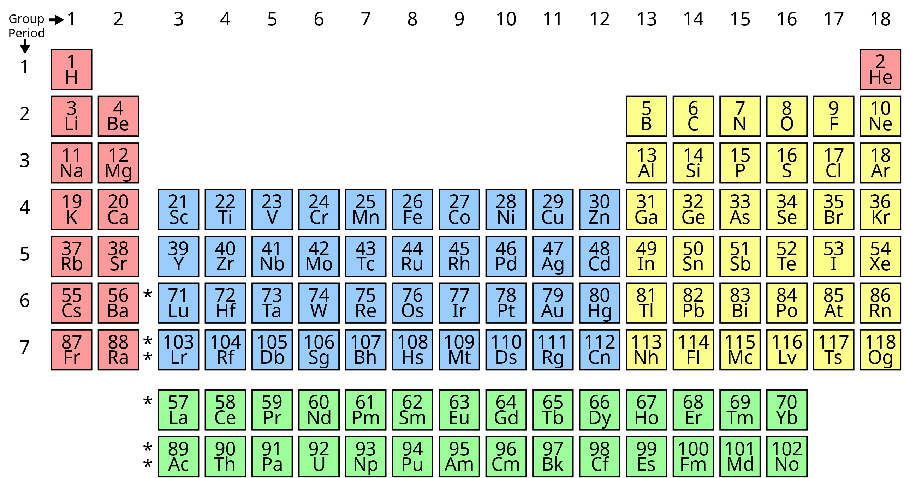

# Vad är periodiska systemet?
Dmitrij Mendelejev ordnar under mitten av 1800-talet de då upptäkta grundämnena efter atommassa. Då kände man till ca 60 grundämnen. Han märkte att vissa av dessa grundämnen hade vissa gemenskapa egenskaper och att dessa upprepades efter ett visst intervall; med viss _periodivisitet_.
Han skapade då ett första periodiskt system. Det var lite annorlunda från det nutida, men ändå liknande. Det hade 8 grupper där namnen var romerska siffrorna som ordningstal: I, II, III, ..., VII, VIII. Grundämnena i samma grupp har liknande egenskaper eftersom de har lika många valenselektroner, men det visste man inte då eftersom elektronen inte var upptäckt ännu. Han lämnade också "luckor" i sitt periodiska system där han förutspådde att det skulle finnas andra grunämnen, som ännu inte var upptäckta. Dessa förutspåningar kunde han göra genom att kolla på kringligande grundämnen och hitta mönster och därmed luska ut var andra grundämnen borde finnas. Eftersom alla ämnen i en grupp har liknande egenskaper kunda han dessutom förutspå dess egenskaper. Han lyckades, bland annat, förutspå Gallium och dess egenskaper.
Det periodiska systemet blev sett som ett bra verktyg eftersom det sorterade grundämen efter dess egenskaper.

# Det moderna periodiska systemet
I det moderna periodiska systemet representerar de lodräta kolumnerna grupper och de vågräta raderna representerar perioder. Grundämnen i samma grupp har samma antal valenselektroner. Därav har grupp 1 en valenselktron, grupp 2 har två, men sedan hoppar det till grupp 13, som har tre valenselektroner. Så fortsätter det fram till grupp 18 som har åtta valenselektroner. (I grupp 18 finns dock ett undantag, Helium, som endast har två valenselektroner.) Grupp 3-12 kallas för _övergångsmetaller_ och har lite mer komplex elektronkonfiguration och följer inte helt denna regel.
En annan sak som går att se i det periodiska systemet är att grupperna längre åt höger har lägre metallkaraktär än de längre åt vänster. Generellt sett har grupperna till höger mindre atomer (i volym) än de till vänster, jämfört med andra atomer åt vänster i samma period. Det kan låta konstigt att atomer med fler elektroner tar mindre volym, men det är för att de har högre laddning i kärnan, och därmed drar elektronerna starkare mot kärnan och tar mindre plats.
Alla grundämnen i samma period har samma antal elektronskal. I den första perioden har atomerna ett elektronskal, i den andra två, osv. Det betyder också att atomernas storlek (volym) ökar ju längre ned den är i periodiska systmet. Det betyder att Francium ($\ce{^{223}_{87}Fr}$) är den till volymen största atomen. Det eftersom den är längst ned till vänster.
Eftersom elektronerna runt atomerna till vänster i periodiska systemet sitter _lösare_ (på grund av svagare atomladdning) så ökar reativiteten ju större perioden är, då elektronerna längre ut sitter allt _lösare_. Den högra sidan, å andra sidan, håller starkare i sina elektroner, därför minskar reaktiviteten ju högre perioden är, eftersom högre perioder har fler protoner och därmed starkare kärnladdning som håller fast elektronerna. 

## Gruppernas namn
| Grupp   | Namn                                     | Valenselektroner |
|---------|------------------------------------------|------------------|
| 1 (1A)  | Alkalimetall                             | 1                |
| 2 (2A)  | Alkaliska jordartsmetaller               | 2                |
| 13 (3A) | Borgruppen                               | 3                |
| 14 (4A) | Kolgruppen                               | 4                |
| 15 (5A) | Kvävegruppen                             | 5                |
| 16 (6A) | Syregruppen                              | 6                |
| 17 (7A) | Halogener (Saltbildare)                  | 7                |
| 18 (8A) | Ädelgaser                                | 8 (2 för Helium) |
| 3-12    | Övergångsmetaller, lantanider, aktinider |                  |
## Periodiska systemet

_User:Double sharp, based on File:Simple Periodic Table Chart-en.svg by User:Offnfopt, CC BY-SA 4.0 <https://creativecommons.org/licenses/by-sa/4.0>, via Wikimedia Commons_